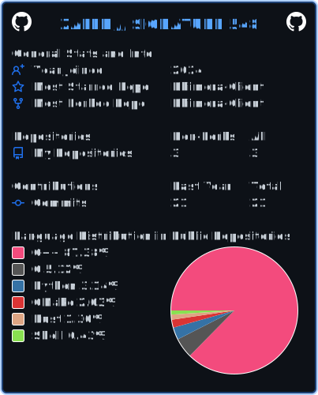

<!--
╔══════════════════════════════════════════════════════════════════╗
║                         SIGNATURE: 548                           ║
╚══════════════════════════════════════════════════════════════════╝
-->

<div align="center">


```text
███████╗ █████╗ ██╗     ███████╗██╗  ██╗
╚══███╔╝██╔══██╗██║     ██╔════╝██║ ██╔╝
  ███╔╝ ███████║██║     █████╗  █████╔╝
 ███╔╝  ██╔══██║██║     ██╔══╝  ██╔═██╗
███████╗██║  ██║███████╗███████╗██║  ██╗
╚══════╝╚═╝  ╚═╝╚══════╝╚══════╝╚═╝  ╚═╝

       O F F E N S I V E   S E C U R I T Y

                  SIGNATURE: 548
```


</div>

---

## `> whoami`

```console
┌──(zalek㉿548)-[~/profile]
└─$ whoami --verbose

Name............. Zalek
Username......... Zalek548
Alias............ Agent 548
Role............. Offensive Security Student
Focus............ Reverse Engineering
Interests........ Binary Analysis and Exploit Development
Status........... Learning never stops
Platform......... Linux
Signature........ 548
```

```console
┌──(zalek㉿548)-[~/profile]
└─$ cat objective.txt

I study how systems work internally.

My goal is to understand software, binaries and operating systems
at a deeper level through programming and offensive security.
```

---

## `> skills --list`

<div align="center">


<br/>


</div>

```text
┌─────────────────────── SKILL DATABASE ────────────────────────┐
│                                                              │
│  PROGRAMMING                                                 │
│  ├── Python                                                  │
│  ├── C++                                                     │
│  ├── C                                                       │
│  ├── Java                                                    │
│  ├── Lua                                                     │
│  └── Brainfuck                                               │
│                                                              │
│  SECURITY                                                    │
│  ├── Offensive Security                                     │
│  ├── Reverse Engineering                                    │
│  ├── Binary Analysis                                        │
│  ├── Malware Research                                       │
│  ├── Exploit Development                                    │
│  └── Capture The Flag                                       │
│                                                              │
│  SIGNATURE.............................................. 548  │
└──────────────────────────────────────────────────────────────┘
```

---

## `> github-stats --user Zalek548`

<div align="center">



</div>

```text
┌────────────────────── PROFILE ANALYSIS ───────────────────────┐
│                                                              │
│  SOURCE........................................ GitHub API    │
│  UPDATE......................................... AUTOMATIC    │
│  OPERATOR........................................... ZALEK    │
│  SIGNATURE............................................ 548    │
│                                                              │
└──────────────────────────────────────────────────────────────┘
```

---

## `> streak --scan`

<div align="center">


</div>

---

## `> coding-time --wakatime`

```text
┌──────────────────────── CODING ACTIVITY ────────────────────────┐
│                                                                │
│  Dados registrados automaticamente pelo WakaTime.              │
│  Editor conectado...................................... ONLINE  │
│  Operator............................................... ZALEK  │
│  Signature.................................................548  │
│                                                                │
└────────────────────────────────────────────────────────────────┘
```

<!--START_SECTION:waka-->
```text
Waiting for WakaTime data...
```
<!--END_SECTION:waka-->

---

## `> activity --graph`

<div align="center">


</div>

---

## `> snake --execute`

<div align="center">


</div>

```text
┌──────────────────────── SNAKE PROCESS ──────────────────────────┐
│                                                                │
│  Contribution grid..................................... LOADED  │
│  Dark environment...................................... ACTIVE  │
│  Operator............................................... ZALEK  │
│  Signature.................................................548  │
│                                                                │
└────────────────────────────────────────────────────────────────┘
```

---

## `> mission --status`

<div align="center">


<br/>


</div>

```text
╔════════════════════════ CURRENT MISSION ════════════════════════╗

  OPERATING SYSTEMS      ████████░░░░░░░░░░░░  40%
  REVERSE ENGINEERING    ██████░░░░░░░░░░░░░░  30%
  PYTHON AUTOMATION      ████████████░░░░░░░░  60%
  BINARY ANALYSIS        ██████░░░░░░░░░░░░░░  30%
  OFFENSIVE SECURITY     ████░░░░░░░░░░░░░░░░  20%

  STATUS............................................. IN PROGRESS
  OPERATOR................................................ ZALEK
  SIGNATURE................................................. 548

╚═════════════════════════════════════════════════════════════════╝
```

---

## `> projects --scan`

```text
┌──────────────────────── PROJECT DATABASE ───────────────────────┐
│                                                                │
│  ./security-tools                                              │
│  ./reverse-engineering                                         │
│  ./low-level-experiments                                       │
│  ./ctf-writeups                                                │
│  ./project-548                                                 │
│                                                                │
│  STATUS.......................................... INITIALIZING  │
│  PUBLIC PROJECTS................................... LOADING...  │
│                                                                │
└────────────────────────────────────────────────────────────────┘
```

<div align="center">

<a href="https://github.com/Zalek548?tab=repositories">
  
</a>

</div>

---

## `> contact --open-channel`

<div align="center">

<a href="mailto:arezalek548@gmail.com">
  
</a>

<a href="https://github.com/Zalek548">
  
</a>

<a href="https://www.instagram.com/zalek548/">
  
</a>


</div>

```console
┌──(secure-channel㉿548)-[~]
└─$ contact --list

Discord........... Zalek548
Instagram......... @Zalek548
Email............. arezalek548@gmail.com
GitHub............ github.com/Zalek548

Connection status: AVAILABLE
```

---

## `> identity --verify`

```text
┌──────────────────────────────────────────────────────────────────┐
│                                                                  │
│  IDENTITY                                                        │
│                                                                  │
│  USER................. ZALEK                                     │
│  USERNAME............. ZALEK548                                  │
│  UID.................. 548                                       │
│  FIELD................ OFFENSIVE SECURITY                        │
│  STATUS............... LEARNING                                  │
│  SIGNATURE............ VERIFIED                                  │
│                                                                  │
│  Some names become known.                                        │
│  Others become signatures.                                       │
│                                                                  │
│                              548                                 │
│                                                                  │
└──────────────────────────────────────────────────────────────────┘
```

---

<div align="center">

## `> final-message`

```text
“O rank parecia estável,

até um número incomum aparecer em todo o Top 4.”

~548
```

```console
zalek@548:~$ exit

Session terminated.
Identity preserved.
Signature preserved: 548
```


</div>

<!-- END OF FILE -->
<!-- SIGNATURE: 548 -->
